# Retail Data Platform

A production-style learning project that builds batch and streaming data paths
for retail analytics. The platform uses PostgreSQL as the operational source,
Kafka and Debezium for change data capture (CDC), and BigQuery as the analytical
warehouse.

## Project status

The source snapshot pipeline and the PostgreSQL-to-Kafka CDC infrastructure are
complete. The next milestone is Dagster-orchestrated batch ingestion from
PostgreSQL into BigQuery Bronze.

| Layer | Status |
| --- | --- |
| Synthetic retail data generation | Complete |
| PostgreSQL source schema and snapshot load | Complete |
| Snapshot validation | Complete |
| PostgreSQL -> Debezium -> Kafka CDC | Complete |
| BigQuery Bronze, Silver, and Gold datasets | Provisioned |
| Dagster batch ingestion into Bronze | Next |
| Flink streaming processing | Planned |
| dbt warehouse transformations | Planned |

## Architecture

Solid arrows show the implemented local flow. Dashed arrows show the next and
planned stages.

```mermaid
flowchart LR
    Generator["Python data generator"] --> CSV["Retail CSV snapshots"]
    CSV --> Loader["Python snapshot loader"]
    Loader --> Postgres["PostgreSQL source"]

    Postgres -->|"logical WAL"| Debezium["Debezium Connect"]
    Debezium --> Kafka["Kafka CDC topics"]

    Postgres -.->|"batch extraction"| Dagster["Dagster"]
    Dagster -.-> Bronze["BigQuery Bronze"]

    Kafka -.-> Flink["Flink / Flink SQL"]
    Flink -.-> Bronze

    Bronze -.-> DBT1["dbt staging models"]
    DBT1 -.-> Silver["BigQuery Silver"]
    Silver -.-> DBT2["dbt business models"]
    DBT2 -.-> Gold["BigQuery Gold"]
    Gold -.-> Analytics["BI and analytics"]
```



Component ownership is intentionally separated:

- **Dagster** orchestrates batch ingestion and data checks.
- **Debezium and Kafka** capture and transport source changes.
- **Flink** processes streaming events.
- **BigQuery Bronze** is the raw landing layer for batch and streaming data.
- **dbt** transforms Bronze data into Silver and Gold analytical models.

## Source data model

The generated dataset represents four related retail entities:

| Table | Default rows | Description |
| --- | ---: | --- |
| `customers` | 100,000 | Customer identity and country |
| `products` | 10,000 | Product catalogue and pricing |
| `orders` | 1,000,000 | Customer orders and status |
| `order_items` | 2,000,000 | Products and quantities within orders |

PostgreSQL enforces primary keys, foreign keys, uniqueness, non-negative prices,
positive quantities, and indexes on the main relationship and date columns.

## Repository structure

```text
retail-data-platform/
├── dagster/                 # Planned batch orchestration
├── dbt/                     # Planned warehouse transformations
├── dev/data/                # Generated CSV data (not committed)
├── docker/postgres/init/    # PostgreSQL source schema
├── flink/jobs/              # Planned Flink jobs
├── flink-sql/               # Planned streaming SQL
├── monitoring/              # Planned observability configuration
├── scripts/                 # Synthetic data generator
├── src/ingestion/           # Snapshot loading and validation
├── terraform/               # Planned cloud infrastructure
├── tests/                   # Planned automated tests
├── docker-compose.yml       # Local PostgreSQL, Kafka, Debezium, and Flink
└── requirements.txt         # Current Python dependencies
```

## Local setup

### Prerequisites

- Python 3.12
- Docker with Docker Compose
- Enough local storage for the generated dataset and container volumes

### 1. Create the Python environment

```bash
python3.12 -m venv .venv
source .venv/bin/activate
python -m pip install --upgrade pip
python -m pip install -r requirements.txt
```

### 2. Generate the source data

The ingestion pipeline reads from `dev/data` by default.

```bash
python scripts/generate_data.py --output dev/data
```

Generation is deterministic with the default random seed of `42`. Row counts,
the output directory, and the seed can be changed through the script's command
line options.

### 3. Start the local platform

```bash
docker compose up -d
docker compose ps
```

The compose stack starts:

- PostgreSQL on `localhost:5432`
- Kafka on `localhost:9092`
- Debezium Connect on `localhost:8083`
- Flink JobManager on `localhost:8081`
- Flink TaskManager

### 4. Load and validate the PostgreSQL snapshot

```bash
python -m src.ingestion.pipeline
```

The snapshot load runs as one transaction:

1. Truncate the four source tables.
2. Bulk-load the CSV files with PostgreSQL `COPY`.
3. Validate the expected row counts.
4. Validate referential integrity between the tables.
5. Commit only after all validations succeed.

## CDC notes

PostgreSQL is configured with logical replication enabled. Kafka exposes an
internal listener for container-to-container communication and an external
listener for local development. Debezium Connect reads PostgreSQL changes and
publishes them to Kafka topics.

The connector registration is currently runtime state and is not recreated by
`docker compose up` alone. Versioning that registration payload is a remaining
reproducibility improvement for the CDC setup.

## Configuration

The ingestion pipeline supports these environment variables:

| Variable | Default |
| --- | --- |
| `DATA_DIR` | `dev/data` |
| `POSTGRES_HOST` | `localhost` |
| `POSTGRES_PORT` | `5432` |
| `POSTGRES_DB` | `retail` |
| `POSTGRES_USER` | `retail_user` |
| `POSTGRES_PASSWORD` | `retail_password` |

The defaults are intended only for local development.

## Roadmap

- [x] Generate deterministic retail source data
- [x] Build the PostgreSQL snapshot ingestion pipeline
- [x] Add row-count and referential-integrity validation
- [x] Configure PostgreSQL, Kafka, and Debezium CDC infrastructure
- [ ] Version the Debezium connector registration
- [ ] Build Dagster assets for PostgreSQL -> BigQuery Bronze
- [ ] Build Flink streaming transformations and the BigQuery sink
- [ ] Build dbt Bronze -> Silver -> Gold models and tests
- [ ] Add monitoring, automated tests, and Terraform infrastructure

## License

This project is licensed under the terms in [LICENSE](LICENSE).
