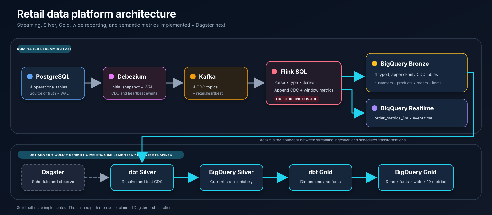

# Retail Data Platform

A production-style learning project that combines streaming ingestion with
scheduled warehouse transformations for retail analytics. PostgreSQL is the
operational source, Debezium and Kafka carry change data capture (CDC) events,
Flink lands those events in BigQuery, and Dagster orchestrates dbt models after
the Bronze layer.

## Project status

The source snapshot pipeline and the first PostgreSQL-to-Kafka CDC path are
complete. The current Debezium connector captures `orders`; the next ingestion
milestone is to capture all four source tables and use Flink to land their raw
CDC events in BigQuery Bronze.

| Layer | Status |
| --- | --- |
| Synthetic retail data generation | Complete |
| PostgreSQL source schema and snapshot load | Complete |
| Snapshot validation | Complete |
| PostgreSQL -> Debezium -> Kafka CDC for `orders` | Complete |
| CDC coverage for all four source tables | Next |
| BigQuery Bronze, Silver, and Gold datasets | Provisioned |
| Flink Kafka -> BigQuery Bronze sink | Planned |
| Dagster + dbt Bronze -> Silver -> Gold processing | Planned |

## Architecture



Component ownership is intentionally separated:

- **PostgreSQL** remains the operational source of truth.
- **Debezium** performs the initial snapshot and then captures committed row
  changes from PostgreSQL WAL.
- **Kafka** stores the raw CDC stream in table-specific topics.
- **Flink** performs stateless parsing and routing into BigQuery Bronze.
- **BigQuery Bronze** stores the append-only raw CDC event history.
- **Dagster** schedules and observes the daily dbt transformation jobs.
- **dbt** incrementally resolves Bronze events into current relational state in
  Silver, runs data-quality tests, and builds Gold business aggregations.

## Processing workflow

The ingestion path is streaming from the source through Bronze:

```text
PostgreSQL -> Debezium -> Kafka -> Flink -> BigQuery Bronze
```

When a Debezium connector starts without stored offsets, it takes a consistent
snapshot of every included table and writes one read event per row to Kafka.
After the snapshot completes, the same connector continuously publishes
inserts, updates, and deletes from PostgreSQL WAL. This keeps related entities
such as customers, orders, and order items on the same ingestion path and avoids
waiting for a separate daily source extract.

The scheduled batch boundary begins after Bronze:

```text
Dagster -> dbt: Bronze -> Silver -> Gold
```

dbt performs the stateful warehouse work: deduplication, applying the latest CDC
operation, relationship checks, joins, and aggregations. Dagster provides the
schedule, dependency orchestration, retries, observability, and test execution;
it does not extract PostgreSQL tables into Bronze.

## Source data model

The generated dataset represents four related retail entities:

| Table | Default rows | Description |
| --- | ---: | --- |
| `customers` | 100,000 | Customer identity and country |
| `products` | 10,000 | Product catalogue and pricing |
| `orders` | 1,000,000 | Customer orders and status |
| `order_items` | 2,000,000 | Products and quantities within orders |

PostgreSQL enforces primary keys, foreign keys, uniqueness, non-negative prices,
positive quantities, and indexes on the main relationship and date columns.

## Repository structure

```text
retail-data-platform/
├── dagster/                 # Dagster orchestration for dbt jobs
├── dbt/                     # Bronze -> Silver -> Gold models and tests
├── dev/data/                # Generated CSV data (not committed)
├── docker/postgres/init/    # PostgreSQL source schema
├── docs/                    # Architecture and workflow diagrams
├── flink/jobs/              # Planned Flink jobs
├── flink-sql/               # Planned streaming SQL
├── monitoring/              # Planned observability configuration
├── scripts/                 # Synthetic data generator
├── src/ingestion/           # Snapshot loading and validation
├── terraform/               # Planned cloud infrastructure
├── tests/                   # Planned automated tests
├── docker-compose.yml       # Local PostgreSQL, Kafka, Debezium, and Flink
└── requirements.txt         # Current Python dependencies
```

## Local setup

### Prerequisites

- Python 3.12
- Docker with Docker Compose
- Enough local storage for the generated dataset and container volumes

### 1. Create the Python environment

```bash
python3.12 -m venv .venv
source .venv/bin/activate
python -m pip install --upgrade pip
python -m pip install -r requirements.txt
```

### 2. Generate the source data

The ingestion pipeline reads from `dev/data` by default.

```bash
python scripts/generate_data.py --output dev/data
```

Generation is deterministic with the default random seed of `42`. Row counts,
the output directory, and the seed can be changed through the script's command
line options.

### 3. Start the local platform

```bash
docker compose up -d
docker compose ps
```

The compose stack starts:

- PostgreSQL on `localhost:5432`
- Kafka on `localhost:9092`
- Debezium Connect on `localhost:8083`
- Flink JobManager on `localhost:8081`
- Flink TaskManager

### 4. Load and validate the PostgreSQL snapshot

```bash
python -m src.ingestion.pipeline
```

The snapshot load runs as one transaction:

1. Truncate the four source tables.
2. Bulk-load the CSV files with PostgreSQL `COPY`.
3. Validate the expected row counts.
4. Validate referential integrity between the tables.
5. Commit only after all validations succeed.

## CDC notes

PostgreSQL is configured with logical replication enabled. Kafka exposes an
internal listener for container-to-container communication and an external
listener for local development. Debezium Connect reads PostgreSQL changes and
publishes each captured table to its own Kafka topic.

The currently registered connector captures only `public.orders` and publishes
to `retail.public.orders`. The target design includes `customers`, `products`,
`orders`, and `order_items` so their initial snapshots and subsequent changes
all reach Kafka before data is routed into Bronze.

The connector registration is currently runtime state and is not recreated by
`docker compose up` alone. Versioning that registration payload is a remaining
reproducibility improvement for the CDC setup.

## Configuration

The ingestion pipeline supports these environment variables:

| Variable | Default |
| --- | --- |
| `DATA_DIR` | `dev/data` |
| `POSTGRES_HOST` | `localhost` |
| `POSTGRES_PORT` | `5432` |
| `POSTGRES_DB` | `retail` |
| `POSTGRES_USER` | `retail_user` |
| `POSTGRES_PASSWORD` | `retail_password` |

The defaults are intended only for local development.

## Roadmap

- [x] Generate deterministic retail source data
- [x] Build the PostgreSQL snapshot ingestion pipeline
- [x] Add row-count and referential-integrity validation
- [x] Configure PostgreSQL, Kafka, and Debezium CDC infrastructure
- [x] Snapshot and stream `orders` into Kafka
- [ ] Version the Debezium connector registration
- [ ] Expand CDC capture to `customers`, `products`, `orders`, and `order_items`
- [ ] Build the stateless Flink Kafka -> BigQuery Bronze sink
- [ ] Build incremental dbt Bronze -> Silver -> Gold models and tests
- [ ] Orchestrate dbt models, tests, and freshness checks with Dagster
- [ ] Add monitoring, automated tests, and Terraform infrastructure

## License

This project is licensed under the terms in [LICENSE](LICENSE).
