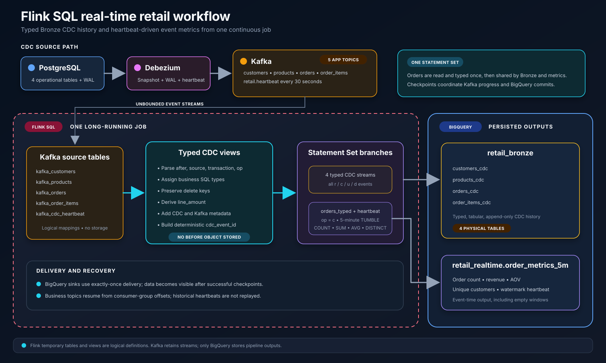

# Retail Data Platform

A production-style retail data platform built to practise reproducible change
data capture, low-latency stream processing, cloud data warehousing, and
scheduled analytics transformations.

PostgreSQL is the operational source. Debezium captures committed changes,
Kafka stores the CDC streams, Flink SQL parses and types the events, and
BigQuery persists both append-only Bronze history and five-minute real-time
order metrics. Dagster and dbt will own the scheduled transformations after
Bronze.

## Project status

| Capability | Status |
| --- | --- |
| Deterministic synthetic retail data | Complete |
| PostgreSQL schema, snapshot load, and validation | Complete |
| PostgreSQL publication and Debezium CDC connector | Complete |
| Four table-specific Kafka CDC topics | Complete |
| Debezium heartbeat topic | Complete |
| Flink SQL typed CDC processing | Complete |
| Four BigQuery Bronze CDC tables | Complete |
| Five-minute event-derived order metrics | Complete |
| Dagster + dbt Bronze to Silver to Gold processing | Planned |
| Monitoring and infrastructure as code | Planned |

## Architecture


The completed real-time ingestion path is shown in more detail below.



The components have intentionally separate responsibilities:

- **PostgreSQL** is the operational source of truth.
- **Debezium** performs the initial snapshot and continuously reads committed
  changes from PostgreSQL WAL. It also publishes heartbeat events.
- **Kafka** durably stores four table-specific CDC streams and one heartbeat
  stream.
- **Flink SQL** parses the Debezium JSON, assigns SQL types, derives useful
  fields, attaches CDC and Kafka metadata, and writes low-latency datasets.
- **BigQuery Bronze** stores typed, append-only CDC event history. It does not
  store the Debezium `before` object.
- **BigQuery Realtime** stores five-minute event-time order metrics produced by
  Flink.
- **dbt** will resolve CDC history into current relational state, test it, and
  build Silver and Gold analytical models.
- **Dagster** will schedule, orchestrate, retry, and observe the dbt jobs.

## Data flow

```text
PostgreSQL
    -> Debezium
    -> Kafka
    -> Flink SQL
    -> BigQuery Bronze + BigQuery Realtime
    -> Dagster + dbt
    -> BigQuery Silver + Gold
```

### PostgreSQL to Kafka

The source contains four related entities:

| PostgreSQL table | Default rows | Kafka topic |
| --- | ---: | --- |
| `customers` | 100,000 | `retail.public.customers` |
| `products` | 10,000 | `retail.public.products` |
| `orders` | 1,000,000 | `retail.public.orders` |
| `order_items` | 2,000,000 | `retail.public.order_items` |
| **Total** | **3,110,000** | |

When no connector offsets exist, Debezium takes a consistent initial snapshot.
Snapshot events use operation `r`. After the snapshot, inserts, updates, and
deletes are published from PostgreSQL WAL with operations `c`, `u`, and `d`.

The idempotent `cdc-bootstrap` service reconciles the PostgreSQL publication,
the five application topics, and the Debezium connector through their
respective APIs. Re-running it does not delete source data, topics, offsets, or
the replication slot.

The fifth application topic, `retail.heartbeat`, is emitted every 30 seconds.
It advances event time for the order-metrics branch even when no new order
arrives.

### Kafka to BigQuery Bronze

The four CDC topics map to four physical BigQuery tables:

| Kafka topic | BigQuery destination |
| --- | --- |
| `retail.public.customers` | `retail_bronze.customers_cdc` |
| `retail.public.products` | `retail_bronze.products_cdc` |
| `retail.public.orders` | `retail_bronze.orders_cdc` |
| `retail.public.order_items` | `retail_bronze.order_items_cdc` |

Flink temporary tables are logical Kafka source and BigQuery sink definitions;
they do not hold intermediate data. Temporary views continuously transform
each incoming event by:

- reading the Debezium `after`, `source`, transaction, and operation fields;
- assigning SQL types to the business fields;
- preserving the record identifier on deletes by falling back to the Kafka
  key;
- deriving `line_amount` for order items;
- adding source, Debezium, Kafka, and Flink timestamps and metadata; and
- creating a deterministic `cdc_event_id` from topic, partition, and offset.

Bronze remains append-only. Updates and deletes are stored as new CDC event
rows; dbt will later resolve the latest operation for each business key.

### Event-derived metrics

The orders topic is parsed once. Flink branches the shared `orders_typed` view
into the Bronze sink and the metrics calculation instead of reading and parsing
the Kafka topic twice.

The metrics branch combines new-order events (`operation = 'c'`) with the
heartbeat stream and applies a five-minute event-time tumbling window. Results
are written to:

```text
retail_realtime.order_metrics_5m
```

Each row contains:

- window start and end;
- new-order count;
- gross revenue;
- average order value;
- unique customers;
- the heartbeat that advanced the watermark; and
- the metric generation timestamp.

Heartbeat-only windows are intentionally retained. They produce a zero order
count and zero gross revenue, with a null average order value, proving that the
stream is healthy even during periods without orders.

## Delivery and recovery

All five outputs run in one long-lived Flink SQL Statement Set:

- four BigQuery Bronze sinks; and
- one BigQuery real-time metrics sink.

The BigQuery sinks use the connector's `exactly-once` delivery guarantee.
Flink checkpoints every 15 seconds and retains checkpoint state on
cancellation. Kafka offsets and BigQuery writes are committed with successful
checkpoints, so records that were not committed before a failure can be safely
replayed.

The four business sources start from their Kafka consumer-group offsets. The
heartbeat source starts at the latest offset because historical heartbeats are
not business data and do not need to be replayed.

## Repository structure

```text
retail-data-platform/
├── dagster/                     # Planned dbt orchestration
├── dbt/                         # Planned Silver and Gold models
├── dev/data/                    # Generated CSV files; ignored by Git
├── docker/
│   ├── flink/                   # Flink image, runtime config, dependencies
│   ├── kafka/                   # CDC bootstrap image and Python requirements
│   └── postgres/init/           # PostgreSQL source schema
├── docs/                        # Architecture and workflow diagrams
├── flink/jobs/                  # Flink pipeline submission script
├── flink-sql/                   # Sources, views, sinks, and Statement Set
├── kafka/                       # Idempotent CDC bootstrap package
├── monitoring/                  # Planned observability configuration
├── scripts/                     # Synthetic data generator
├── src/ingestion/               # Snapshot load and validation
├── terraform/                   # Planned cloud infrastructure
├── tests/                       # Automated test area
├── docker-compose.yml           # Local data-platform services
└── requirements.txt             # Local snapshot-ingestion dependency
```

## Technology versions

| Component | Version |
| --- | --- |
| Python | 3.12 |
| PostgreSQL | 16 |
| Apache Kafka | 4.0.0 |
| Debezium Connect | 3.6.0.Final |
| Apache Flink | 1.20.5, Scala 2.12, Java 17 |

Flink 1.20.5 is used because it includes fixes required by this SQL Statement
Set and connector combination.

## Local setup

### Prerequisites

- Python 3.12
- Docker with Docker Compose
- Google Cloud CLI
- A GCP project with BigQuery enabled
- BigQuery datasets named `retail_bronze`, `retail_realtime`,
  `retail_silver`, and `retail_gold`

### 1. Configure the environment

Copy the safe template and fill in the machine-specific values:

```bash
cp .env.examples .env
```

At minimum, replace the PostgreSQL password, GCP project ID, and absolute path
to the local Application Default Credentials file. The real `.env` file is
ignored by Git.

Create local Application Default Credentials if they do not already exist:

```bash
gcloud auth application-default login
```

### 2. Create the Python environment

```bash
python3.12 -m venv .venv
source .venv/bin/activate
python -m pip install --upgrade pip
python -m pip install -r requirements.txt
```

### 3. Generate the source data

```bash
python scripts/generate_data.py --output dev/data
```

Generation is deterministic with the default random seed of `42`.

### 4. Start PostgreSQL and load the snapshot

```bash
docker compose up -d postgres
set -a
source .env
set +a
POSTGRES_HOST=localhost python -m src.ingestion.pipeline
```

The snapshot pipeline truncates and loads the four source tables inside one
transaction, validates row counts and referential integrity, and commits only
after every validation succeeds. Docker Compose reads `.env` automatically;
the shell export above makes the same values available to the local Python
process while overriding the container-only hostname.

### 5. Start CDC and Flink

```bash
docker compose up --build -d \
  cdc-bootstrap \
  flink-jobmanager \
  flink-taskmanager
```

Confirm the one-shot bootstrap completed successfully:

```bash
docker compose logs cdc-bootstrap
```

The persistent services remain running after `cdc-bootstrap` exits with code
zero.

### 6. Submit the Flink SQL pipeline

```bash
docker compose exec flink-jobmanager \
  /opt/flink/jobs/submit_realtime_pipeline.sh
```

The script renders the SQL with environment values, submits one detached
Statement Set, and prints the Flink Job ID. The job remains running after the
SQL client exits.

Open the Flink dashboard at [http://localhost:8081](http://localhost:8081) and
confirm that the job and all five sink branches are running.

## Configuration reference

| Variable | Purpose |
| --- | --- |
| `POSTGRES_HOST` | PostgreSQL host used inside Compose |
| `POSTGRES_PORT` | PostgreSQL port |
| `POSTGRES_DB` | Source database name |
| `POSTGRES_USER` | Source database user |
| `POSTGRES_PASSWORD` | Source database password |
| `KAFKA_BOOTSTRAP_SERVERS` | Kafka internal listener |
| `KAFKA_TOPIC_PREFIX` | Prefix for table-specific CDC topics |
| `KAFKA_TOPIC_PARTITIONS` | Partition count for application topics |
| `KAFKA_TOPIC_REPLICATION_FACTOR` | Replication factor for application topics |
| `DEBEZIUM_URL` | Kafka Connect REST endpoint |
| `DEBEZIUM_CONNECTOR_NAME` | PostgreSQL connector name |
| `DEBEZIUM_HEARTBEAT_TOPIC` | Heartbeat topic consumed by Flink |
| `DEBEZIUM_HEARTBEAT_INTERVAL_MS` | Debezium heartbeat interval |
| `POSTGRES_PUBLICATION_NAME` | Logical-replication publication |
| `POSTGRES_REPLICATION_SLOT_NAME` | Debezium replication slot |
| `GOOGLE_CLOUD_PROJECT` | BigQuery project ID |
| `GOOGLE_ADC_PATH` | Host path to the ADC JSON file mounted read-only |

## Roadmap

- [x] Generate deterministic retail source data
- [x] Load and validate the PostgreSQL snapshot
- [x] Build reproducible PostgreSQL-to-Kafka CDC infrastructure
- [x] Snapshot 3,110,000 records across four source tables
- [x] Stream live WAL changes into four Kafka topics
- [x] Add Debezium heartbeats for event-time progress
- [x] Parse and type all four CDC streams with Flink SQL
- [x] Load four append-only BigQuery Bronze tables
- [x] Produce heartbeat-driven five-minute order metrics
- [x] Configure checkpoint-backed exactly-once BigQuery delivery
- [ ] Build incremental dbt Bronze to Silver models and tests
- [ ] Build dimensional and reporting models in BigQuery Gold
- [ ] Orchestrate dbt jobs and quality checks with Dagster
- [ ] Add production monitoring and Terraform infrastructure

## License

This project is licensed under the terms in [LICENSE](LICENSE).
